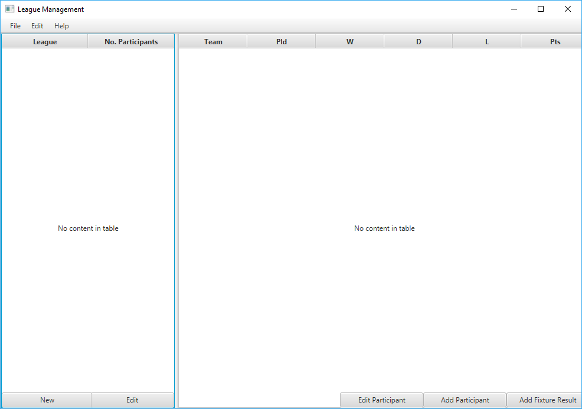

# LeagueManagement

#### Two Applications

| App Name        | Function           | User  |
| ------------- |:-------------:| -----:|
| CreateUserApp      | Create accounts for product customer | Product Administrator |
| MainApp      | Customer administration      |   Customer |

## Application Screenshots
### CreateUserApp

#### Create User Account Application

### MainApp
#### Login

#### Main Window (no data)

#### Main Window (filled)

#### New league

#### Add/Edit Fixture Results
